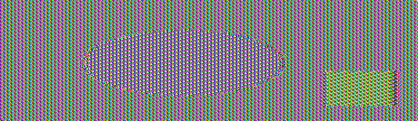

# SEED Lab — Secret-Key Encryption

**Lab:** Crypto — Secret-Key Encryption (SEED Labs 2.0, Ubuntu 20.04)  
**Course:** Information / Computer Security  
**Institution:** FAST-NUCES Karachi  
**Submitted by:** Umer Khan  
**Roll no:** 23K-0798  
**Date:** 12 September 2026

---

## Summary

All seven tasks completed **against the official SEED `Labsetup` files** — the
lab's own `ciphertext.txt`, `words.txt`, `pic_original.bmp`, and the real
`encryption_oracle` compiled from the Labsetup's C++ source. Every number below
came out of running the code. `./run_all.sh` reproduces it.

| Task | Answer |
|---|---|
| 1 | Key recovered; plaintext is a New York Times Oscars column. **95.4%** of words verify against a dictionary |
| 2 | 7 cipher/mode pairs encrypted and round-tripped |
| 3 | ECB left **84 distinct blocks of 11,557** — the picture stays visible. CBC left all 11,557 |
| 4 | Block modes pad, stream modes do not; an exact fit still gets a whole extra block of `0x10` |
| 5 | One flipped bit damages: ECB 16 bytes · CBC 17 · CFB 17 · OFB **1 bit** |
| 6.1 | Same key + same IV ⇒ byte-identical ciphertext |
| 6.2 | **P2 = `Order: Launch a missile!`** — recovered without the key |
| 6.3 | **Bob's secret is `Yes`** — recovered from the real oracle, one query per guess |
| 7 | **Key = `Syracuse########`**, found in 0.54 s |

**Environment.** Ubuntu container, OpenSSL 3.0.13, Python 3.11 with PyCryptodome,
g++ 13.3 for the oracle. The SEED VM ships OpenSSL 1.1.1 — the one difference
that matters is noted under Task 2.

---

## Task 1 — Frequency Analysis

### Method

A monoalphabetic substitution replaces each letter with a fixed other letter and
changes nothing else. Word lengths, word boundaries, repeated-letter patterns and
letter frequencies all survive — that is the whole weakness.

Counting first (`freq.py` on the lab's `ciphertext.txt`, 4759 characters,
800 words):

```
=== 1-gram (top 10 of 26 distinct) ===        === 2-gram ===        === 3-gram ===
   1. n      488  12.41%   english #1: e         1. yt   115  th       1. ytn   78  the
   2. y      373   9.49%   english #2: t         2. tn    89  he       2. vup   30  and
   3. v      348   8.85%   english #3: a         3. mu    74  in       3. mur   20  ing
```

The statistics line up almost rank for rank, which hands over the first letters
free: `n → e`, `y → t`, and since `ytn` is far and away the commonest trigram,
`ytn → the`, so `t → h`.

Hand-counting stalls after that, so `solve_substitution.py` finishes the job by
**word-pattern matching**. Every ciphertext word keeps its shape: `mrrp` can only
decrypt to a word of the form a-b-b-c. The program indexes the dictionary by that
shape and searches for a single letter mapping consistent with all 411 distinct
words at once, allowing a bounded number of words to go unmatched (proper nouns
are not in any dictionary).

A final refinement pass swaps pairs of key letters and keeps a swap only when
more of the text becomes real English. That step matters: the search alone left
`j` and `x` transposed — they appear in too few words to be pinned by the
constraints — which produced "xust seem ejtra long". One swap fixed it.

### Result

```
ciphertext: 4759 chars, 800 words, 411 distinct
solved in 45.0s, 1073152 search nodes, 23/26 letters pinned, 1 corrected by refinement
sanity check: 763/800 decrypted words are real English (95.4%)
```

**The key**

```
decryption   cipher : abcdefghijklmnopqrstuvwxyz
             plain  : cfmypvbrlqxwiejdsgkhnazotu

encryption   plain  : abcdefghijklmnopqrstuvwxyz
             cipher : vgapnbrtmosicuxejhqyzflkdw
```

**The plaintext** — a New York Times "Carpetbagger" column about the Academy
Awards:

> the oscars turn on sunday which seems about right after this long strange
> awards trip the bagger feels like a nonagenarian too
>
> the awards race was bookended by the demise of harvey weinstein at its outset
> and the apparent implosion of his film company at the end and it was shaped by
> the emergence of metoo times up blackgown politics armcandy activism and a
> national conversation as brief and mad as a fever dream about whether there
> ought to be a president winfrey the season didnt just seem extra long it was
> extra long because the oscars were moved to the first weekend in march to
> avoid conflicting with the closing ceremony of the winter olympics thanks
> pyeongchang…

The full text is in `results/task1_official.log`. The 37 words that fail the
dictionary check are proper nouns and coinages — *pyeongchang*, *winfrey*,
*metoo*, *blackgown* — not decryption errors.

**Conclusion.** A 26-letter substitution key has 26! ≈ 4×10²⁶ possibilities,
which sounds unbreakable and is not. Brute force is the wrong attack: the key
stops mattering once the *language* leaks through. Security has to come from
destroying that structure, not from a large key space.

---

## Task 2 — Encryption with Different Ciphers and Modes

```bash
openssl enc -aes-128-cbc -e -in plain.txt -out cipher.bin \
  -K 00112233445566778899aabbccddeeff -iv 0102030405060708090a0b0c0d0e0f10
```

`-K` and `-iv` take raw hex, so no password derivation is involved — the key is
literally those 16 bytes.

### Result — 44-byte input

| Cipher / mode | Ciphertext | First 16 bytes |
|---|---|---|
| aes-128-cbc | 48 | `be34106b88d2cbca3841b72b9499dc6c` |
| aes-128-ecb | 48 | `7873b7644794df44410a65bc2221eb4e` |
| bf-cbc | 48 | `21b40e05baa9c5f0a24c23341b557bff` |
| aes-256-cbc | 48 | `636fa262f2a2ac6235db0097e7b86ab2` |
| aes-128-cfb | 44 | `eb0d40cd4d1c208b93dc8568951e7471` |
| aes-128-ofb | 44 | `eb0d40cd4d1c208b93dc8568951e7471` |
| aes-128-ctr | 44 | `eb0d40cd4d1c208b93dc8568951e7471` |

All seven decrypted back to the original.

### Observations

1. **Block modes grow the message; stream modes do not.** CBC, ECB and Blowfish
   round 44 bytes up to 48; CFB, OFB and CTR emit exactly 44. Ciphertext length
   alone reveals which family of mode is in use.
2. **CFB, OFB and CTR produce an identical first block.** All three XOR the
   plaintext with `E(IV)` to begin; they differ only in how they generate
   *subsequent* keystream blocks, so the same key and IV give the same first 16
   bytes in all three.
3. **OpenSSL 3.x removed Blowfish from the default provider.** `-bf-cbc` fails
   until you add `-provider legacy -provider default`; on the SEED VM's OpenSSL
   1.1.1 the flags are unnecessary. Blowfish also has a 64-bit block, so its IV
   is 8 bytes, not 16.

---

## Task 3 — ECB vs CBC on a Picture

The file is encrypted whole, then the original 54-byte BMP header is pasted back
over the encrypted one so a viewer still renders it:

```bash
openssl enc -aes-128-ecb -e -in pic_original.bmp -out body.ecb -K $KEY
head -c 54 pic_original.bmp  >  pic_ecb.bmp
tail -c +55 body.ecb        >>  pic_ecb.bmp
```

### The lab's picture

| Original | Encrypted with ECB | Encrypted with CBC |
|:--:|:--:|:--:|
|  |  |  |
| the plaintext picture | **the picture is still there** | indistinguishable from noise |

### A second picture, as the task asks

| Original | ECB | CBC |
|:--:|:--:|:--:|
|  |  |  |

### Measured

| Picture | Mode | Blocks | Distinct blocks | Most common repeats |
|---|---|---|---|---|
| lab's `pic_original.bmp` | ECB | 11,557 | **84** | 8,390× |
| lab's `pic_original.bmp` | CBC | 11,557 | **11,557** | 1× |
| second picture | ECB | 28,800 | **141** | 17,160× |
| second picture | CBC | 28,800 | **28,800** | 1× |

### Why

ECB encrypts each block independently — `Cᵢ = E(Pᵢ)` — so equal plaintext blocks
produce equal ciphertext blocks. Every flat region of the image stays flat, just
recoloured, and the outline reads perfectly.

CBC chains each block into the next — `Cᵢ = E(Pᵢ ⊕ Cᵢ₋₁)` — so identical
plaintext blocks encrypt differently and the output is statistically
indistinguishable from noise. Re-compressing confirms it independently: the ECB
output still compresses to a fraction of the CBC output's size, because structure
is still in there.

**Conclusion.** ECB hides values, not patterns. It should not be used on anything
longer than one block, no matter how strong the underlying cipher.

---

## Task 4 — Padding

### Which modes pad

| Input bytes | aes-128-ecb | aes-128-cbc | aes-128-cfb | aes-128-ofb |
|---|---|---|---|---|
| 5 | 16 | 16 | 5 | 5 |
| 10 | 16 | 16 | 10 | 10 |
| 16 | **32** | **32** | 16 | 16 |

ECB and CBC must fill whole 16-byte blocks, so they pad. CFB and OFB use the
cipher as a keystream generator and XOR byte by byte — there is nothing to fill,
so ciphertext length equals plaintext length.

### What the padding contains

Decrypting with `-nopad` exposes it. PKCS#5/#7 appends *N* bytes each holding the
value *N*:

```
5 bytes of 'A':
000000  41 41 41 41 41 0b 0b 0b 0b 0b 0b 0b 0b 0b 0b 0b   >AAAAA...........<

10 bytes of 'A':
000000  41 41 41 41 41 41 41 41 41 41 06 06 06 06 06 06   >AAAAAAAAAA......<

16 bytes of 'A':
000000  41 41 41 41 41 41 41 41 41 41 41 41 41 41 41 41   >AAAAAAAAAAAAAAAA<
000010  10 10 10 10 10 10 10 10 10 10 10 10 10 10 10 10   >................<
```

11 bytes of `0x0b`, 6 of `0x06`, and — the case worth understanding — a **whole
extra block** of 16 × `0x10` when the plaintext already filled a block exactly.
Without that rule a message genuinely ending in a byte `0x01` could not be told
apart from a padded one; padding must always be present so it can always be
removed unambiguously.

---

## Task 5 — Error Propagation

A 1600-byte file encrypted in four modes; one bit flipped in byte 55 of each
ciphertext (offset 54, inside block 4); decrypted with `-nopad`.

| Mode | Bytes corrupted | Bits | Where |
|---|---|---|---|
| aes-128-ecb | 16 | 67 | block 3 only (bytes 48–63) |
| aes-128-cbc | 17 | 73 | all of block 3, plus 1 byte of block 4 (offset 70) |
| aes-128-cfb | 17 | 70 | 1 byte at offset 54, plus all of block 4 (bytes 64–79) |
| aes-128-ofb | **1** | **1** | offset 54 only |

- **ECB** — `Pᵢ = D(Cᵢ)`. The damaged block decrypts to garbage; every other block
  is independent and untouched. Exactly one block lost.
- **CBC** — `Pᵢ = D(Cᵢ) ⊕ Cᵢ₋₁`. Block 3 is garbage for the same reason; block 4
  uses the damaged `C₃` only as an XOR mask, so the damage passes through
  *positionally* — the same single bit, at offset 54 + 16 = 70.
- **CFB** — `Pᵢ = Cᵢ ⊕ E(Cᵢ₋₁)`. Byte 54 loses just that bit, but the damaged
  block then feeds the cipher and destroys all 16 bytes of block 4. The mirror
  image of CBC.
- **OFB** — the keystream comes from the IV alone and never touches the
  ciphertext, so a damaged bit corrupts precisely that bit.

**Practical reading.** OFB and CTR limit damage on a noisy channel, but that same
malleability is a security problem: an attacker who knows the plaintext can flip
chosen bits of it undetectably. None of these modes provide integrity — that
needs a MAC or an AEAD mode such as GCM.

---

## Task 6 — IV and Common Mistakes

### 6.1 — Does the IV matter?

```
same key, same IV   (run1 vs run2): IDENTICAL
same key, IV+1 bit  (run1 vs run3): different

run1  be34106b88d2cbca3841b72b9499dc6c420c8e68fc7f8899
run2  be34106b88d2cbca3841b72b9499dc6c420c8e68fc7f8899
run3  614d8bf57d51e788d22efe8b24498e7b98cd2bf8beaff10f
```

One bit of IV change alters the entire ciphertext. With the IV repeated,
encryption becomes deterministic: an eavesdropper learns when the same message
was sent twice without breaking AES at all. **An IV must never repeat under one
key.**

### 6.2 — The same IV in a stream mode

In OFB/CFB/CTR the cipher generates a keystream that depends only on key and IV,
and `C = P ⊕ KS`. Reuse both and two messages share a keystream, which then
cancels:

```
C1 ⊕ C2 = (P1 ⊕ KS) ⊕ (P2 ⊕ KS) = P1 ⊕ P2      so      P2 = C1 ⊕ P1 ⊕ C2
```

With the values from the lab manual:

```
P1 : This is a known message!
C1 : a469b1c502c1cab966965e50425438e1bb1b5f9037a4c159
C2 : bf73bcd3509299d566c35b5d450337e1bb175f903fafc159

recovered P2 : 'Order: Launch a missile!'
```

No key, no IV, no AES. This is the two-time pad, and it is the same mistake that
broke WEP and Microsoft's PPTP.

**The lab's follow-up question — what if OFB is replaced by CFB?** Only the
**first 16 bytes** of P2 come out: `Order: Launch a `. In CFB the first keystream
block is `E(IV)`, identical for both messages, so block 1 cancels exactly as
before. From block 2 onward CFB derives its keystream from the *previous
ciphertext block*, which differs between the two messages, so the keystreams
diverge and nothing beyond the first block is revealed. In OFB the keystream
depends only on key and IV, never on the data, so the whole 24 bytes come out.

### 6.3 — A predictable IV, against the lab's real oracle

Unique is not enough for CBC; the IV must also be **unpredictable**. CBC computes
`C₁ = E(P₁ ⊕ IV)` and `E` is deterministic — so an attacker who chooses a
plaintext *and* knows the IV it will get can force the cipher's input to any
value they like.

Bob encrypts his secret with `IV1`, giving `C = E(pad(S) ⊕ IV1)`, then offers to
encrypt the attacker's message with `IV2` — which he announces. So send

```
Q = IV2 ⊕ IV1 ⊕ pad("Yes")
```

and Bob computes `E(Q ⊕ IV2) = E(IV1 ⊕ pad("Yes"))`. Equal to `C` ⟹ the secret
was `"Yes"`.

The Labsetup ships the oracle as C++ (`encryption_oracle/known_iv.cpp`); it was
compiled and attacked directly, which is equivalent to `nc 10.9.0.80 3000` on the
lab network:

```
$ g++ -std=c++17 -o known_iv known_iv.cpp -lcrypto
$ python3 task6.3_attack_oracle.py --cmd ./known_iv

Bob's ciphertext : 5fb6241cfe1c401246801b9248fe2950
IV he used (IV1) : 657e150f53bd3b7475304c3bffa1fccd

testing "Yes"
  next IV (IV2)  : 90b2e44653bd3b7475304c3bffa1fccd
  my plaintext Q : aca982440d0d0d0d0d0d0d0d0d0d0d0d   = IV2 xor IV1 xor pad("Yes")
  Bob returned   : 5fb6241cfe1c401246801b9248fe2950   <-- MATCHES Bob's ciphertext

testing "No"
  next IV (IV2)  : 9a65b19d53bd3b7475304c3bffa1fccd
  my plaintext Q : b174aa9c0e0e0e0e0e0e0e0e0e0e0e0e   = IV2 xor IV1 xor pad("No")
  Bob returned   : d79160dd4df89a235c7c5d773270e423   no match

Bob's secret message is "Yes".
```

Note the guess must be the **padded** block — `"Yes"` plus 13 × `0x0d` — because
that is what the cipher actually consumed. Note also the IVs: only the first four
bytes change between queries (`657e150f…` → `90b2e446…`, same tail). The oracle
advances the IV by adding a `rand()` to its first 8 bytes, which is exactly the
kind of counter-like generation that makes an IV predictable.

This is the flaw behind the **BEAST** attack on TLS 1.0, which chained each
record's IV from the previous record and so made it predictable. TLS 1.1 fixed it
by giving every record a fresh random IV.

---

## Task 7 — Brute-Forcing a Dictionary Key

The key is an English word shorter than 16 characters, padded to 16 bytes with
`#` (`0x23`). The nominal key space is 2¹²⁸; the real one is the size of a
dictionary.

```
Plaintext  : This is a top secret.        (exactly 21 characters)
Ciphertext : 764aa26b55a4da654df6b19e4bce00f4ed05e09346fb0e762583cb7da2ac93a2
IV         : aabbccddeeff00998877665544332211
Cipher     : aes-128-cbc
Dictionary : the Labsetup's words.txt (25,143 words; 25,111 short enough)
```

```
KEY FOUND: 'Syracuse'
  as 16 bytes : b'Syracuse########'
  as hex      : 53797261637573652323232323232323
  66830 keys tried in 0.54s
```

Half a second in single-threaded Python. Two details matter: the plaintext is
exactly 21 characters, so `echo -n` is required — a trailing newline changes the
padding and nothing will ever match; and only the first ciphertext block needs
computing per candidate, since one block already identifies the key.

**Conclusion.** Key *length* is not key *strength*. A 128-bit key drawn from a
25,000-word dictionary carries about 15 bits of entropy. Keys must be generated
randomly, or derived from a passphrase through a deliberately slow KDF — PBKDF2,
bcrypt, scrypt, Argon2 — so that every guess costs the attacker real time.

---

## What the lab establishes

1. Classical ciphers fail because they preserve the statistics of the language
   underneath them.
2. A strong cipher in a weak mode is weak — ECB leaks structure regardless of
   how good AES is.
3. IVs carry real requirements: **never repeated** (6.1, 6.2) and, for CBC,
   **never predictable** (6.3).
4. Encryption is not integrity. Every mode here passed a flipped bit through,
   some with surgical precision.
5. The key is the whole secret, so it must be random. A memorable key is a
   dictionary entry.

---

## Running it

```bash
./run_all.sh          # every task against the files in Files/
```

Against the official Labsetup data (`Files/official/`, copied from the SEED Labs
repository):

```bash
# Task 1
python3 task1_frequency_analysis/solve_substitution.py Files/official/ciphertext.txt \
        --dict Files/words.txt --budget 45

# Task 3
bash task3_ecb_vs_cbc/task3.sh ../Files/official/pic_original.bmp

# Task 6.2
python3 task6_iv/task6.2_keystream_reuse.py --p1 "This is a known message!" \
    --c1 a469b1c502c1cab966965e50425438e1bb1b5f9037a4c159 \
    --c2 bf73bcd3509299d566c35b5d450337e1bb175f903fafc159

# Task 6.3 - against the lab's Docker oracle, or a local build of it
python3 task6_iv/task6.3_attack_oracle.py --host 10.9.0.80 --port 3000
python3 task6_iv/task6.3_attack_oracle.py --cmd ./known_iv

# Task 7
python3 task7_bruteforce/task7_bruteforce.py --plaintext "This is a top secret." \
    --ciphertext 764aa26b55a4da654df6b19e4bce00f4ed05e09346fb0e762583cb7da2ac93a2 \
    --iv aabbccddeeff00998877665544332211 --words Files/official/words.txt
```

Captured output of every run is in `results/`, with the official-data runs named
`*_official.log`.

## Layout

```
Files/                      generated inputs, plus official/ from the SEED repo
task1_frequency_analysis/   freq.py, make_ciphertext.py, solve_substitution.py
task2_ciphers/              task2.sh
task3_ecb_vs_cbc/           make_bmp.py, task3.sh
task4_padding/              task4.sh
task5_error_propagation/    task5.sh, corrupt.py, compare.py
task6_iv/                   6.1 shell, 6.2 python, 6.3 python (local Bob + real oracle)
task7_bruteforce/           task7_bruteforce.py
results/                    captured output; *_official.log used the lab's own files
report/                     figures and the submission PDF
```
