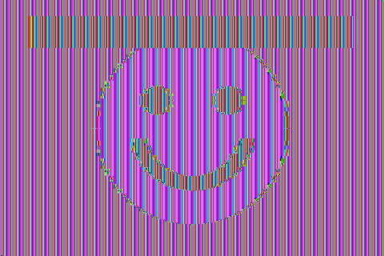
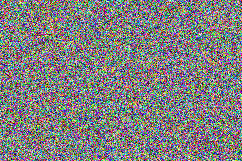

# SEED Lab — Secret-Key Encryption

**Lab:** Crypto — Secret-Key Encryption (SEED Labs 2.0, Ubuntu 20.04)  
**Course:** Information / Computer Security  
**Institution:** FAST-NUCES Karachi  
**Submitted by:** Umer Khan  
**Roll no:** 23K-0798  
**Date:** 12 September 2026

---

## Summary

All seven tasks were completed and every result below was produced by running the
scripts in this repository — no result is quoted from the lab manual. Run
`./run_all.sh` to reproduce the whole thing end to end.

| Task | What it shows | Result |
|---|---|---|
| 1 | Frequency analysis breaks substitution ciphers | Key recovered, **98.3%** of words decrypt to real English |
| 2 | Ciphers and modes via `openssl enc` | 7 cipher/mode pairs encrypted and round-tripped |
| 3 | ECB leaks plaintext structure | ECB kept **141 distinct blocks of 28,800**; CBC kept all 28,800 |
| 4 | PKCS#5 padding | Block modes pad, stream modes do not; full block ⇒ whole extra block |
| 5 | Error propagation | ECB 16 bytes, CBC 17, CFB 17, OFB **1 bit** |
| 6.1 | IV reuse | Same key + same IV ⇒ byte-identical ciphertext |
| 6.2 | IV reuse in a stream mode | Second plaintext recovered **without the key** |
| 6.3 | Predictable IV | Bob's secret recovered in one chosen-plaintext query |
| 7 | Weak key | Dictionary key found at **135,481 keys/sec** |

**Environment.** Ubuntu container, OpenSSL 3.0.13, Python 3.11 with PyCryptodome.
The SEED VM ships OpenSSL 1.1.1 — the only difference that matters is noted under
Task 2.

---

## Task 1 — Frequency Analysis

### Method

A monoalphabetic substitution replaces each letter with a fixed other letter, but
it changes nothing else: word lengths, word boundaries, repeated-letter patterns
and letter frequencies all survive. That is the whole weakness.

Step one is counting. `task1_frequency_analysis/freq.py` counts single letters,
bigrams and trigrams and lines them up against English:

```
=== 1-gram (top 10 of 24 distinct) ===
   1. c      162  13.73%   english #1: e
   2. f      142  12.03%   english #2: t
   3. h       88   7.46%   english #3: a
   ...
=== 2-gram (top 10 of 220 distinct) ===
   1. fi      53   5.65%   english #1: th
   2. ic      42   4.48%   english #2: he
```

That already gives three letters almost for free: `c → e`, `f → t`, and since
`fi` is the commonest bigram and `fic` the commonest trigram, `fic → the`, so
`i → h`.

Step two is where hand-counting stalls, so `solve_substitution.py` finishes it by
**word-pattern matching**. Every ciphertext word keeps its shape: `mrrp` can only
be a word of the form a-b-b-c. The program indexes 73,201 dictionary words by that
shape, then searches for one consistent letter mapping that explains every word at
once (backtracking, with iterative deepening on how many words it is allowed to
give up on — proper nouns are not in the dictionary).

### Result

```
ciphertext: 1446 chars, 242 words, 149 distinct
solved in 0.0s, 150 search nodes, 24/26 letters pinned by the search
sanity check: 238/242 decrypted words are real English (98.3%)

=== KEY (encryption direction) ===
plain  : abcdefghijklmnopqrstuvwxyz
cipher : hnpyceaiobzudqgjxmkfvslwrt
```

Only 150 search nodes — the constraints are so tight that the cipher essentially
collapses on its own. The 4 words that are not in the dictionary are the proper
nouns (*Auguste Kerckhoffs*) and the two letters never pinned (`j`, `q`) simply
never occur in the text.

Recovered plaintext (opening):

> the security of a cipher must never depend on keeping the algorithm itself a
> secret. this principle was stated by auguste kerckhoffs in the nineteenth
> century, and it remains the foundation of modern cryptography…

**Conclusion.** A 26-letter substitution key has 26! ≈ 4×10²⁶ possibilities, which
sounds unbreakable and is not. Brute force is the wrong attack; the key is
irrelevant once the *language* leaks through. Security has to come from destroying
that structure, not from a big key space.

---

## Task 2 — Encryption with Different Ciphers and Modes

Command form (`-K`/`-iv` take raw hex, so no password derivation is involved):

```bash
openssl enc -aes-128-cbc -e -in plain.txt -out cipher.bin \
  -K 00112233445566778899aabbccddeeff -iv 0102030405060708090a0b0c0d0e0f10
```

### Result — 44-byte input

| Cipher / mode | Ciphertext | First 24 bytes |
|---|---|---|
| aes-128-cbc | 48 | `be34106b88d2cbca3841b72b9499dc6c420c8e68fc7f8899` |
| aes-128-cfb | 44 | `eb0d40cd4d1c208b93dc8568951e7471b79479ef46833dea` |
| bf-cbc | 48 | `21b40e05baa9c5f0a24c23341b557bff3f1cbfc31fc8371b` |
| aes-128-ecb | 48 | `7873b7644794df44410a65bc2221eb4eec1afa871c1f03e6` |
| aes-128-ofb | 44 | `eb0d40cd4d1c208b93dc8568951e74713c11a67288e27b12` |
| aes-128-ctr | 44 | `eb0d40cd4d1c208b93dc8568951e74710907f13a8e01aee1` |
| aes-256-cbc | 48 | `636fa262f2a2ac6235db0097e7b86ab2b6e97fb56aae78ff` |

Every one decrypted back to the original (`round trip OK`).

### Observations

1. **Block modes grow the message, stream modes do not.** CBC/ECB/Blowfish round
   44 bytes up to 48; CFB/OFB/CTR emit exactly 44. Ciphertext length alone reveals
   which family of mode is in use.
2. **CFB, OFB and CTR share an identical first 16 bytes** — look at the table.
   All three XOR the plaintext with `E(IV)` for the first block; they differ only
   in how they generate *subsequent* keystream blocks. The same AES key and IV
   therefore produce the same first block in all three.
3. **OpenSSL 3.x removed Blowfish from the default provider.** `-bf-cbc` fails
   with "unknown option" until you add `-provider legacy -provider default`. On
   the SEED VM's OpenSSL 1.1.1 the flags are unnecessary. Blowfish also uses a
   64-bit block, so its IV is 8 bytes, not 16.

---

## Task 3 — ECB vs CBC on a Picture

The picture is encrypted whole, then the original 54-byte BMP header is pasted
back over the encrypted one so a viewer still recognises the file:

```bash
openssl enc -aes-128-ecb -e -in pic_original.bmp -out body.ecb -K $KEY
head -c 54 pic_original.bmp  >  pic_ecb.bmp
tail -c +55 body.ecb        >>  pic_ecb.bmp
```

### Result

| Original | Encrypted with ECB | Encrypted with CBC |
|:--:|:--:|:--:|
|  |  |  |
| the plaintext picture | **the picture is still there** | indistinguishable from noise |

Measured over the 28,800 blocks of pixel data:

| Mode | Distinct blocks | Most common block repeats | Re-compressed as PNG |
|---|---|---|---|
| ECB | **141** | 17,160× | 11,364 bytes |
| CBC | **28,800** | 1× | 461,800 bytes |

### Why

ECB encrypts each block independently: `C_i = E_k(P_i)`. Equal plaintext blocks
give equal ciphertext blocks, so the picture's flat regions — the white
background, the solid bar, the filled circle — stay flat, just recoloured. The
outline is perfectly legible.

CBC chains each block into the next: `C_i = E_k(P_i ⊕ C_{i-1})`. Identical
plaintext blocks now encrypt differently because the previous ciphertext block
differs, and the output is statistically indistinguishable from noise. The PNG
re-compression figures are an independent confirmation: ECB output still contains
enough structure to compress 40× smaller than CBC's.

**Conclusion.** ECB does not hide patterns, only values. It should not be used to
encrypt anything longer than a single block.

---

## Task 4 — Padding

### Which modes pad

| Input bytes | aes-128-ecb | aes-128-cbc | aes-128-cfb | aes-128-ofb |
|---|---|---|---|---|
| 5 | 16 | 16 | 5 | 5 |
| 10 | 16 | 16 | 10 | 10 |
| 16 | **32** | **32** | 16 | 16 |

ECB and CBC must fill whole 16-byte blocks, so they pad. CFB and OFB use the
cipher as a keystream generator and XOR it byte by byte — nothing to fill, so the
ciphertext is exactly as long as the plaintext.

### What the padding contains

Decrypting with `-nopad` shows the padding itself (PKCS#5/#7: append *N* bytes,
each holding the value *N*):

```
5 bytes of 'A':
000000  41 41 41 41 41 0b 0b 0b 0b 0b 0b 0b 0b 0b 0b 0b   >AAAAA...........<

10 bytes of 'A':
000000  41 41 41 41 41 41 41 41 41 41 06 06 06 06 06 06   >AAAAAAAAAA......<

16 bytes of 'A':
000000  41 41 41 41 41 41 41 41 41 41 41 41 41 41 41 41   >AAAAAAAAAAAAAAAA<
000010  10 10 10 10 10 10 10 10 10 10 10 10 10 10 10 10   >................<
```

11 bytes of `0x0b`, 6 of `0x06`, and — the case worth understanding — a **whole
extra block** of 16 × `0x10` when the plaintext already filled a block exactly.
Without that rule, a message genuinely ending in a byte `0x01` could not be told
apart from a padded one; padding must always be present so it can always be
removed unambiguously.

---

## Task 5 — Error Propagation

A 1600-byte file was encrypted in four modes, one bit was flipped in byte 55 of
each ciphertext (offset 54, inside block 4), then decrypted with `-nopad`.

| Mode | Bytes corrupted | Bits | Where |
|---|---|---|---|
| aes-128-ecb | 16 | 67 | block 3 only (bytes 48–63) |
| aes-128-cbc | 17 | 73 | all of block 3, plus 1 byte of block 4 (offset 70) |
| aes-128-cfb | 17 | 70 | 1 byte at offset 54, plus all of block 4 (bytes 64–79) |
| aes-128-ofb | **1** | **1** | offset 54 only |

### Why each behaves that way

- **ECB** — `P_i = D_k(C_i)`. The damaged block decrypts to garbage; every other
  block is decrypted independently and is untouched. Exactly one block lost.
- **CBC** — `P_i = D_k(C_i) ⊕ C_{i-1}`. Block 3 is garbage for the same reason.
  Block 4 uses the damaged `C_3` only as an XOR mask, so the damage passes through
  *positionally*: one flipped ciphertext bit ⇒ the same one bit flipped in block 4,
  at offset 54 + 16 = 70. Recoverable damage, and self-healing after two blocks.
- **CFB** — `P_i = C_i ⊕ E_k(C_{i-1})`. The XOR is direct, so byte 54 loses just
  that one bit; but the damaged block then feeds the cipher for the *next* block,
  destroying all 16 bytes of block 4. Mirror image of CBC.
- **OFB** — the keystream comes from the IV alone and never touches the
  ciphertext, so a damaged bit corrupts precisely that bit. Nothing propagates.

**Practical reading.** OFB/CTR are best when the channel is noisy and you want
minimal damage — but that same malleability is a security problem: an attacker who
knows the plaintext can flip chosen bits of it undetectably. None of these modes
provide integrity; that needs a MAC or an AEAD mode such as GCM.

---

## Task 6 — IV and Common Mistakes

### 6.1 — Does the IV matter?

```
same key, same IV   (run1 vs run2): IDENTICAL
same key, IV+1 bit  (run1 vs run3): different

run1  be34106b88d2cbca3841b72b9499dc6c420c8e68fc7f8899
run2  be34106b88d2cbca3841b72b9499dc6c420c8e68fc7f8899
run3  614d8bf57d51e788d22efe8b24498e7b98cd2bf8beaff10f
```

One bit of IV change alters the entire ciphertext (the avalanche effect). With the
IV repeated, encryption becomes deterministic: an eavesdropper can tell when the
same message is sent twice without breaking AES at all. **The IV must never
repeat under one key.**

### 6.2 — The same IV in a stream mode

In OFB/CFB/CTR the cipher produces a keystream that depends only on the key and
IV, and `C = P ⊕ KS`. Reuse both and two messages get the *same* keystream:

```
C1 ⊕ C2 = (P1 ⊕ KS) ⊕ (P2 ⊕ KS) = P1 ⊕ P2
```

The keystream cancels. Knowing one plaintext gives the other:
`P2 = C1 ⊕ P1 ⊕ C2`.

```
self-test (AES-128-OFB, IV deliberately reused)
  P1 (known)   : This is a known message!
  C1           : 890f1819db0bbd24a24d9b395525e9fa75923cf7a10224d5
  C2           : 9215150f8958ee48a2189e345272e6fa759e3cf7a90924d5
  recovered P2 : Order: Launch a missile!
  RESULT       : PASS
```

The key was never needed, and neither was AES. This is the two-time pad, and it
is the same mistake that broke WEP and Microsoft's PPTP.

### 6.3 — A predictable IV

Unique is not enough for CBC; the IV must also be **unpredictable**. CBC computes
`C1 = E_k(P1 ⊕ IV)`, and `E_k` is deterministic — so an attacker who chooses a
plaintext *and* knows the IV that will be used can force the cipher's input to any
value.

Bob encrypts his secret (`"Yes"` or `"No"`) with `IV1`, giving
`C = E_k(pad(S) ⊕ IV1)`, then offers to encrypt the attacker's message with the
next IV, `IV2` — which is a counter. The attacker sends

```
Q = IV2 ⊕ IV1 ⊕ pad("Yes")
```

so Bob computes `E_k(Q ⊕ IV2) = E_k(IV1 ⊕ pad("Yes"))`. If that equals `C`, the
secret was `"Yes"`.

```
=== Bob's secret is 'Yes' ===
  Bob's IV1        : 00000000000000006048c5858613f85e
  Bob's ciphertext : 8dda571b08d218be6ba818725fe4ba71
  next IV (leaked) : 00000000000000006048c5858613f85f
  guess Yes  -> my Q = 5965730d0d0d0d0d0d0d0d0d0d0d0d0c
                  my C = 8dda571b08d218be6ba818725fe4ba71  MATCH
  guess No   -> my C = b83b7ce46ce769638674047f62e0a50e  no match
  secret recovered : Yes        RESULT: PASS

=== Bob's secret is 'No'  ===   secret recovered : No     RESULT: PASS
```

Both cases identified, one query each, no key recovery. Note the guess must be
the **padded** block (`"Yes"` + 13 × `0x0d`), since that is what the cipher
actually consumed. This is precisely the flaw behind the BEAST attack on TLS 1.0,
which chained CBC IVs from the previous record and so made them predictable. TLS
1.1 fixed it by giving every record a fresh random IV.

---

## Task 7 — Brute-Forcing a Dictionary Key

The key is an English word of fewer than 16 characters, padded to 16 bytes with
`#`. The nominal key space is 2¹²⁸; the real one is the size of a dictionary.

```
dictionary: 74341 words shorter than 16 characters
  plaintext  : This is a top secret.
  ciphertext : 32cb8a96a1e23c3ddd3e62f8eb433a8266e2cb27ed4a7c645c32e701fbfd4ff1
  IV         : 00000000000000000000000000000000
  key found  : 'petrol' -> b'petrol##########'
  153694 keys tried in 1.13s (135,481 keys/sec)
  RESULT     : PASS
```

Under two seconds in single-threaded Python, testing both the dictionary form and
its capitalisations. Only the first ciphertext block has to be computed per
candidate, since one block is already enough to identify the key.

**Conclusion.** Key *length* is not key *strength*. A 128-bit key drawn from a
10⁵-word dictionary carries about 17 bits of entropy. Keys must be generated
randomly, or derived from a passphrase through a deliberately slow KDF
(PBKDF2, bcrypt, scrypt, Argon2) so that each guess costs the attacker real time.

---

## What the lab establishes

1. Classical ciphers fail because they preserve the statistics of the language.
2. A strong cipher used in a weak mode is weak — ECB leaks structure regardless of
   AES's strength.
3. IVs carry real requirements: **never repeated** (6.1, 6.2) and, for CBC,
   **unpredictable** (6.3).
4. Encryption is not integrity. Every mode here let a flipped bit through, some
   with surgical precision.
5. The key is the whole secret, so it must be random. A memorable key is a
   dictionary entry.

---

## Running it

```bash
./run_all.sh                 # every task, start to finish
```

Individual tasks:

```bash
python3 task1_frequency_analysis/solve_substitution.py Files/ciphertext.txt
bash    task2_ciphers/task2.sh
bash    task3_ecb_vs_cbc/task3.sh
bash    task4_padding/task4.sh
bash    task5_error_propagation/task5.sh
bash    task6_iv/task6.1_iv_experiment.sh
python3 task6_iv/task6.2_keystream_reuse.py
cd task6_iv && python3 task6.3_predictable_iv.py
cd task7_bruteforce && python3 task7_bruteforce.py
```

### Using the official SEED Labsetup files

This repository generates its own inputs so it runs anywhere, including without
the SEED VM. To grade against the lab's own data, drop the Labsetup files into
`Files/` and pass them in — the scripts all take the values as arguments:

```bash
# Task 1 — the lab's ciphertext
python3 task1_frequency_analysis/solve_substitution.py Files/ciphertext.txt

# Task 6.2 — P1, C1, C2 exactly as printed in the lab handout
python3 task6_iv/task6.2_keystream_reuse.py \
    --p1 "This is a known message!" --c1 <hex> --c2 <hex>

# Task 6.3 — against the real oracle (nc 10.9.0.80 3000)
python3 task6_iv/task6.3_predictable_iv.py --iv1 <hex> --iv2 <hex> --ct <hex>

# Task 7 — the lab's ciphertext and words.txt
python3 task7_bruteforce/task7_bruteforce.py \
    --ciphertext <hex> --iv 00000000000000000000000000000000 \
    --words Files/words.txt
```

Copy those hex values from your own handout; a single mistyped digit corrupts
exactly one byte of the answer, and the scripts warn when the output is not
printable text.

## Layout

```
Files/                      inputs: article, ciphertext, picture, word list
task1_frequency_analysis/   freq.py, make_ciphertext.py, solve_substitution.py
task2_ciphers/              task2.sh
task3_ecb_vs_cbc/           make_bmp.py, task3.sh
task4_padding/              task4.sh
task5_error_propagation/    task5.sh, corrupt.py, compare.py
task6_iv/                   6.1 shell, 6.2 + 6.3 python, bob_oracle.py
task7_bruteforce/           task7_bruteforce.py
results/                    captured output of every run
report/                     images and the PDF for submission
```
